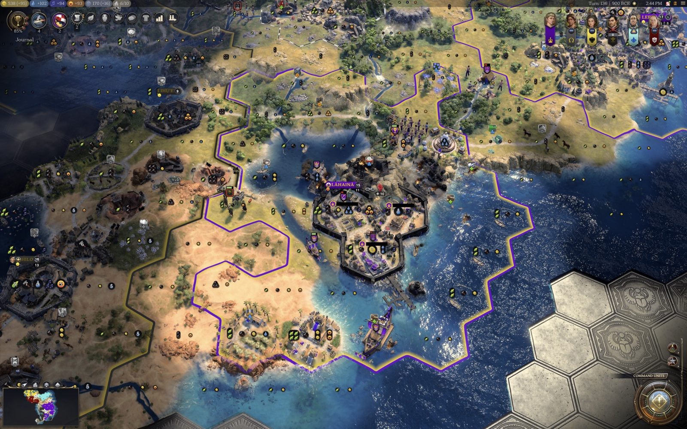
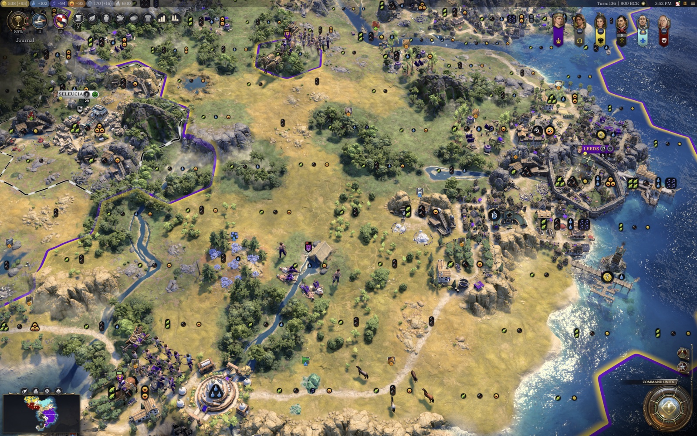

# Cultural Diffusion (Civ VII)

A reimagining and extension of the Cultural Diffusion mod for Civilization V, rebuilt
for Civ VII. Culture is a per-tile field that spreads outward from your cities over the
course of the game. A strong, established culture slowly pushes its borders past the
normal city footprint into open land, and can take a rival's frontier tiles where its
culture clearly wins. Growing your cultural border is how you answer AI forward-settling.

*The Cultural Pressure lens: the shaded band is the tiles your culture is winning.*

| Before | After |
| --- | --- |
|  |  |

*The same camera, before and after cultural expansion takes the frontier west of Leeds. The city starts with the
footprint the base game allows (its own tiles reach ring 3 and no further) and ends holding fourteen tiles beyond
it, at rings 4 and 5. More in [gallery/](gallery/).*

Every major civilization gains land by culture, under the same rules as yours: a rival whose
culture decisively leads a tile near your lands takes it, including a tile of yours, and you
are told when it does. Nearby AI cities add their own culture to the field, which defends
their tiles and slows yours, and their cities keep producing the culture of every people
living in them. Turn off "every civilization gains land by culture" in Options to have culture
gain land only for you.

It runs in single-player only and sits behind an enable flag. Turning it off stops all new
claims, but tiles it already claimed stay yours, because the game cannot hand a city's tile
back to no one. It works standalone, and reads extra data from the
[Emigration](../emigration/) mod when that is also installed.

In game, the Civilopedia has a Cultural Diffusion tab with a page for every rule, and each Options tooltip names
the page that explains it.

---

## How it works: a culture field

The core of the mod, adapted from the Civ V original, is a reaction-diffusion simulation
over a saved, per-tile, per-civilization culture stock. Every tile on the frontier remembers
how much culture each civilization has deposited on it. Once per turn, over a bounded region
around your cities, the mod runs four core steps (inject, diffuse, decay, flip). Steps 5 to 9
build on them.

### 1. Inject: cities pump culture into their own tile
Each city adds culture to the tile it sits on, using a self-amplifying curve
(`strength x sqrt(current x injectRatio) + injectBase`): the more culture already
present, the faster it grows, climbing over many turns toward a cap
(`strength x cityCapFactor`). **Strength** is a *fused* measure of the city's cultural
power rather than its raw culture per turn (see below), so an established or prosperous
city pumps a much bigger stock.

### 2. Diffuse: culture spreads to neighboring tiles
A tile with enough culture (`cultureThreshold`) spreads a fraction of its stock
(`diffusionRate`, about 5.5% a turn) to each of its six neighbors. A neighbor can hold at
most `normalMax` (40%) of the source's value, or up to `maxPercent` (75%) when the culture
follows a road or river. Rough terrain slows or blocks the spread: forest, hills, tundra,
desert, jungle, marsh and mountains each impose a penalty and a crossing threshold the source
must exceed before any culture leaks across. If the [Emigration](../emigration/) mod is
present, diffusion speeds up toward tiles where your diaspora lives, so borders follow people.

Rivers speed culture along them and hold it back across them. Culture moving from one
tile of a river to the next travels faster and farther, and a navigable river carries
it farther than a minor one. Culture stepping onto a river from its bank, or from a
different river, must be strong enough to cross and arrives weakened. Once a culture
holds the river itself, it reaches both banks.

Culture also crosses water, slowly and only once it is strong. Coast is easier to cross than
open ocean, and crossings get easier with each age (`diffuseAcrossWater`,
`byAge[...].waterEase`, `waterEaseRamp`). Tiles in your Distant Lands cannot be claimed before
the Exploration age (`blockDistantLandsBeforeExploration`).

### 3. Decay: every tile slowly loses culture
Each tile sheds `decayRate` (5%) plus a flat point per turn. Decay is the constant brake that
diffusion has to push against. It gives the border a stable equilibrium, keeps growth slow,
and lets culture ebb when the source city weakens or is lost. With the opt-in **borders
recede** option, a rival whose culture overtakes yours on a claimed tile can take it (see
step 5).

### 4. Flip: ownership follows the stock
A tile becomes yours once your culture there is the largest, passes an absolute floor
(`minimumOwner`, 300), and, if you are taking it from a rival, beats their culture on that
tile by a decisive ratio (`flipRatio`, 0.65). It must also be within `flipMaxDistance` (6) of
one of your cities and, while `requireAdjacency` is on (the default), adjacent to land you
already own, so borders grow contiguously. Freshly claimed tiles are locked briefly
(`flipCooldownTurns`) so they do not flicker between owners. By default a rival's city-center
plot is never taken, though culture can press inward through the surrounding tiles ring by
ring. The *rival city protection* option (`coreProtectRadius`) can shield the full downtown
ring instead.

The game applies an ownership change a moment after the mod asks for it, so each flip is
recorded as pending and confirmed from the map at the start of the next pass before it counts
as a claim.

With the opt-in **+1 ring buffer** (`growthBuffer`, off by default), finishing a rural
improvement near your border also claims the unowned tiles right next to it, one ring past
your city's normal reach.

### 5. Recede (opt-in): claimed tiles can be lost again
Off by default (`recedeBorders`). When on, each pass re-checks only the tiles this mod
claimed. If a rival's culture now beats yours there by the same decisive margin a claim
needs, the tile passes to that rival's nearest city. Tiles your cities grew are never touched.
A claim whose own culture fades stays yours, because the engine will not release a tile that
is attached to a city. With "every civilization gains land by culture" on (the default), a rival
that decisively out-cultures a claimed tile near its land already takes it through its own
claim, so recede matters mainly when that option is off.

### 6. Cities carry every culture living in them
On by default (`foreignCultureInCities`). A city produces culture for every people present
on its tile, not only its owner's. The owner injects at full strength. Each foreign group
injects at the city's population strength (`foreignInjectScale`), weighted by that group's
share of the population when the Emigration mod records one, and otherwise only once the
group holds a real stock there (`foreignGroupMinStock`), so a neighbor's trickle is never
amplified. The city-tile cap bounds the total culture on the tile. Each turn the city also
converts a small share of every foreign group's stock to its owner: 0.5% (`convertBase`),
plus a bonus for each science and culture building it has and, in the Modern age, for its
owner's ideology (`convertBonuses`). A captured or mixed city therefore keeps producing its
old culture, which contests the land around it, and that culture fades over the following
decades instead of vanishing on the day of the capture.

### 7. Capture: a conquered city leans toward its conqueror
On by default (`captureTransfer`). When a city changes hands, every culture on each of its
tiles loses 55% (`captureLoss`) and the conqueror gains 75% of the total lost (`captureGain`).
This happens for any two civilizations, not only when you are involved.

### 8. Every civilization gains land by culture
On by default (`aiCultureFlips`). Other civilizations' borders move by culture too,
under the same rules as yours: inside the simulated region, a rival whose culture decisively
leads a tile takes it through its nearest city, if it is at peace with the tile's owner, the
tile is outside the owner's protected core, touches the rival's land and lies within reach of
one of its cities. That includes tiles of yours, and a rival can lose tiles the same way. You
are told when a rival takes one of your tiles. City-states and independent peoples never gain
land this way, and nothing moves far from your cities, because the culture field is only
simulated around them.

### 9. Armies hold the ground they occupy (opt-in)
Off by default (`conquestFlip`). When on, during a war a combat unit that holds an enemy
tile for five consecutive turns (`conquestBufferTurns`) takes it for its owner, whatever the
culture there. Leaving resets the count, so a raid that moves on converts nothing. The
conquered tile is then held for ten turns (`conquestHoldTurns`): culture cannot flip it back
in that time, but another army that holds it through the buffer takes it at any time. After
the hold the tile works the normal way. A conquered tile can change hands again in two ways:
an army retakes it, at any time; or, once peace is made and the hold has run out, culture
retakes it by the standard rule, for any civilization whose culture decisively leads there,
not only the one it was taken from. While the war lasts, culture never moves it in either
direction. City centers and urban districts are never taken this way; cities change hands
only through the game's own capture. Other civilizations' armies do the same only when
"every civilization gains land by culture" is also on.

Two smaller rules carried over from the original complete the model. Culture on a mountain
needs 7.5 times the usual stock before it spreads off the peak (`sourceThresholdMountain`),
and owned land always keeps at least a point of its owner's culture (`ownerFloor`), so it
never reads as empty in the pressure lens.

### Why growth is slow
Culture has to build up ring by ring against decay, so a border's reach grows as a slow wave
outward from each city:

| Distance from city | Who owns it |
| --- | --- |
| Ring 1-3 | Always the base game; the mod never claims or reassigns your inner rings |
| Ring 4 | The first ring the mod claims, once a city's culture stock is large enough |
| Ring 5+ | Only a mature, entrenched culture |

In test games on a mature save, the strongest city made its first ring-4 claim 18 turns after
the mod started from an empty field. The mod held 29 claims after 45 turns, across an age
change, and a town with little culture never came close.

Early in a new game, expect nothing for a long while. In a 70-turn test game at the default
settings, a capital making 8 Culture claimed no tiles at all. At that strength, the pacing model
puts ring 4 out of reach. The mod starts claiming once a city's cultural power grows, so it
matters most from the mid-game onward.

An overwhelming culture injects a far bigger stock, so it pushes the same front out faster
and farther, with no special rule for the leading civilization. A weak or stagnant culture
barely creeps past its border.

### What claimed land does
Civilization VII lets a city work and develop tiles only within three rings of its center,
and that limit lives in the engine, where no mod data can change it (see
[`docs/civ7-tile-range-investigation.md`](docs/civ7-tile-range-investigation.md)). Every tile
this mod claims lies beyond ring 3, so it is territory without yield: it is attached to your
nearest city and shows as yours, but no citizen can work it and nothing can be built on it.
Its value is strategic. It is a buffer against rivals settling next to you, and it includes
frontier tiles taken from a rival. In a test game a settler could found on an empty plot but
not on the plot beside it once another civilization owned it.

---

## Cultural power: what makes a city strong (the fused model)

A city's injection strength is a geometric blend of its culture output and a prosperity
aggregate (`culture^alpha x vitality^(1-alpha)`). Cultural power, not only raw culture,
decides how far your borders reach, and a single big +culture or +happiness ability counts as
one diluted term instead of a linear multiplier. This keeps culture-focused leaders and
civilizations ahead without letting them run away:

- **Culture and a prosperity aggregate (food, production, happiness, growth):** a happy,
  prosperous, growing city pumps much harder than a struggling one, but the blend flattens a
  lone culture spike.
- **Celebration:** a golden age gives a pulse of extra cultural projection.
- **Cultural Power Index (CPI):** a per-civilization multiplier built from your standing
  across six dimensions (wonders and great works, culture per turn, influence and city-state
  suzerainties, happiness and golden ages, empire prosperity, traditions and age). Each is
  measured as your share of the strongest civilization's, and they are combined so that
  breadth of cultural power beats a single-stat spike. A cultural hegemon's cities inject
  harder and reach farther.
- **Ethnic affinity** *(requires Emigration)*: diffusion is pulled toward frontier tiles
  settled by your people.

CPI and prosperity are computed from base-game data alone, and the ethnic-affinity layer is
neutral when Emigration is not installed. Turn the fused model off (`Options -> Mods`) to
drive injection by culture alone.

---

## Configuration

### Intensity presets (`Options -> Mods -> Cultural Diffusion - intensity`)
One setting changes the overall pace. Higher intensity diffuses faster, decays slower, and
needs less culture to own a tile, so borders reach farther, sooner.

| Preset | Diffusion | Decay | Ownership bar | Max distance |
| --- | --- | --- | --- | --- |
| **Low** (gentle nudge, empty land only) | 4.0% | 7% | 400 | 5 |
| **Medium** (default) | 5.5% | 5% | 300 | 6 |
| **High** (assertive) | 7.5% | 4% | 220 | 8 |

### Options toggles
- **Enabled:** master switch (off = vanilla borders).
- **Claim empty land only:** never flip a tile owned by another civilization.
- **Rival city protection:** how deep culture may push into a rival's city (full downtown
  ring, center tile only, or nothing).
- **Contiguous border only:** only claim tiles touching your land.
- **Claim land beside new improvements (+1 ring):** off by default; when on, finishing a rural
  improvement near your border also claims the unowned tiles right next to it.
- **Borders recede (experimental):** off by default; claimed tiles can be ceded to a rival
  whose culture overtakes yours (step 5 above).
- **Every civilization gains land by culture:** on by default; other civilizations' borders
  move by culture under the same rules as yours (step 8 above). Off = only your borders grow
  by culture.
- **Armies hold the ground they occupy:** off by default; a combat unit holding an enemy
  tile through a war takes it after five turns (step 9 above).
- **Cities carry every culture living in them:** on by default; a city produces culture for
  every people present on its tile and slowly converts foreign culture to its own (step 6).
- **Rich cultural model:** fold CPI and prosperity into a city's cultural power. Off = raw
  culture only.
- **Follow diaspora (Emigration mod):** read Emigration for ethnic-affinity diffusion. No
  effect if Emigration is absent.
- **Pressure lens:** on by default; a read-only map lens (Shift+C) that shades the frontier
  tiles about to change hands, with a hover readout of each civilization's stock. With
  "every civilization gains land by culture" on, it also shades a tile another civilization's
  culture is winning, but only when that civilization's own rules would let it take the tile.
- **Debug logging:** per-pass diagnostics to `UI.log`: every injector's strength and
  city-tile stock (`inject`), each city's best ring-4 stock against the ownership bar
  (`frontier`), and the saved state size and pass time (`state bytes=`).

### Full tunables (`ui/cd-config.js`, all overridable)
- **Claiming:** `diffusionEnabled`, `claimOnlyUnowned`, `flipVerb` (`purchasePlot`, code-only),
  `refundGold` (restores any gold a claim costs, through `Players.grantYield`),
  `repairOrphans`, `growthBuffer`, `baseGrowthRadius`, `recedeBorders`.
- **Pacing and safety:** `turnInterval`, `fieldRadius`, `maxDiffusionPlots`,
  `maxFlipsPerTurn`, `flipCooldownTurns`, `coreProtectRadius`, `requireAdjacency`.
- **Field:** `cultureThreshold`, `diffusionRate`, `decayRate`, `decayFlat`,
  `normalMax`, `maxPercent`, `injectBase`, `injectRatio`, `cityCapFactor`,
  `minimumOwner`, `flipRatio`, `flipMaxDistance`, `sourceThresholdMountain`, `ownerFloor`.
- **Cities and capture:** `foreignCultureInCities`, `foreignInjectScale`,
  `foreignGroupMinStock`, `convertBase`, `convertBonuses` (a table keyed by building,
  tradition or ideology type name), `captureTransfer`, `captureLoss`, `captureGain`.
- **Other civilizations and war:** `aiCultureFlips`, `conquestFlip`, `conquestBufferTurns`,
  `conquestHoldTurns`.
- **Terrain and water:** `roadBonus`, `riverFollowBonus`/`riverFollowMax` (along a minor
  river), `navigableFollowBonus`/`navigableFollowMax` (along a navigable river), and a
  `{ malus, max, threshold }` entry per terrain (`terrainHills`, `terrainMountain`,
  `terrainTundra`, `terrainDesert`, `terrainForest`, `terrainJungle`, `terrainMarsh`,
  `terrainRiverCross`, `terrainNavigableCross`, `terrainCoast`, `terrainOcean`), plus
  `diffuseAcrossWater`, `blockDistantLandsBeforeExploration` and `waterEaseRamp`.
- **Injection shaping (fused):** `fusedModel`, `useEmigration`, `cultureWeight`,
  `cultureExponent` (the geometric-blend alpha that dilutes lone culture spikes),
  `happinessAmp`, `wonderBonus`, `ageFactor`, `prosperityAmp`,
  `cpiPowerMin`/`cpiPowerMax`, the six CPI dimension weights
  (`wLegacy` ... `wIdentity`), `ethnicWeight`.
- **Game-settings calibration:** `calibrateToGameSettings`, `paceReferenceTurns`,
  `paceBounds`, `mapSizeScale`. These re-time the field to the current age's length
  (`Game.maxTurns`) so borders grow at the same pace across game speeds, and scale injection
  by map size so small maps are not overrun.
- **Per-age balance:** `byAge`, a `{ injectionScale, ownerBar, waterEase }` entry for each of
  `ANTIQUITY`, `EXPLORATION` and `MODERN`. Later ages have about 8x the cities and 3x the
  culture, so injection is damped and the ownership bar raised to keep a single city's reach
  comparable across ages.
- **Leader, civilization and memento tuning:** `civTuningEnabled`, `civTuningStrength`
  (1 = full table, 0 = every civilization neutral). A bounded registry (`cd-civ-tuning.js`)
  damps culture, wonder, celebration and suzerainty snowball kits and civilizations whose
  bonuses already grant territory (such as Xerxes' culture on capture), and gently lifts
  culture-poor ones. See
  [`mod_ideas_tested/mods_research_and_analysis/cultural-diffusion-leader-civ-memento-and-age-tuning.md`](../../mod_ideas_tested/mods_research_and_analysis/cultural-diffusion-leader-civ-memento-and-age-tuning.md).
- **Diagnostics:** `debug`, which turns on the per-pass log lines listed under Options.

---

## Architecture

The runtime is a set of small, single-responsibility UI-script modules (`ui/`):

| Module | Responsibility |
| --- | --- |
| `cd-bootstrap.js` | Boots the engine, runs one pass per local-player turn, console surface, the +1 ring buffer trigger. |
| `cd-pass.js` | The per-turn simulation: confirm pending -> decay -> diffuse -> inject -> convert -> flip -> AI flips -> recede -> conquest. |
| `cd-pending.js` | Records ownership changes that have not landed yet and confirms them from the map next pass. |
| `cd-recede.js` | Opt-in recede step: cede a claimed tile to a rival whose culture decisively won it. |
| `cd-inject.js` | Cities pump their own and every present culture group under a total cap; conversion; the owner floor. |
| `cd-conversion.js` | A city's conversion rate from its buildings and its owner's ideology (a data table by type name). |
| `cd-flip.js` | The flip commit shared by the player's and the AI's claims. |
| `cd-ai-flips.js` | Every civilization gains land by culture inside the simulated region (on by default). |
| `cd-capture.js` | On a city capture, culture on its tiles passes partly to the conqueror. |
| `cd-conquest.js` | Opt-in: a combat unit holding an enemy tile through a war takes it after a buffer. |
| `cd-diagnostics.js` | Debug-only injector, frontier-ring, and state-size log lines. |
| `cd-field.js` | **Pure** field math (injection, decay, diffusion, ownership resolution). |
| `cd-terrain.js` | Per-step terrain diffusion modifiers (roads, following or crossing a river, rough ground). |
| `cd-pressure.js` | **Pure** injection-strength math (`projectionOf` and factors). |
| `cd-cpi.js` | **Pure** Cultural Power Index (share of the strongest -> geometric mean -> power). |
| `cd-metrics.js` | Base-game per-civilization CPI dimension reads. |
| `cd-polity.js` | Per-settlement culture, happiness, wonder and prosperity reads. |
| `cd-emigration.js` | Optional, import-free bridge to the Emigration mod's data. |
| `cd-ethnicity.js` | Ethnic-affinity diffusion accelerant from composition data. |
| `cd-civ-tuning.js` | Bounded per-leader, civilization and memento injection nudges. |
| `cd-civ-roster.js` | The full game leader, civilization and memento type rosters (data only). |
| `cd-calibration.js` | Age-length (field pace) and map-size (injection) calibration from game settings. |
| `cd-plots.js` | GameplayMap reads (owners, radii, water, dimensions). |
| `cd-borders.js` | City-core protection and war checks. |
| `cd-ownership.js` | The one place that changes ownership (`purchasePlot`, with any gold cost restored through `Players.grantYield`; `setOwnership` only to un-claim). |
| `cd-state.js` | Saved culture field, claims, locks and pending changes (v2 schema), save and reload, pruning. |
| `cd-config.js` | Default tunables and intensity presets. |
| `cd-settings.js` / `cd-options.js` | Options-screen bridge and registration, through `Options.addInitCallback` so settings survive the Settings screen's rebuild. |
| `cd-pressure-lens.js` / `cd-pressure-tooltip.js` | The Cultural Pressure map lens (Shift+C) and its hover readout. |
| `cd-lens-colors.js` | Readable civilization colors for the lens. |
| `cd-notifications.js` | Throttled flip notifications. |
| `cd-log.js` | Logging. |

The pure modules (`cd-field`, `cd-pressure`, `cd-cpi`) carry the algorithm and are
unit-tested in Node with no engine, and `tests/pass.mjs` drives the whole pass against a stub
engine, including ownership that lands a pass late. `npm run verify` runs lint, syntax,
ESM-integrity, and the test suites. Engine behavior is checked in real games with the
hands-free harness in [`devtools/harness/`](devtools/harness/).

---

## Standalone vs. Emigration

The mod does not require Emigration. When Emigration is installed and the "Follow diaspora"
toggle is on, Cultural Diffusion reads its saved population composition (import-free, through
the shared game-config store) to bias diffusion toward your diaspora. When it is absent, that
layer is neutral and everything else works unchanged.

---

## Credits

This mod reimagines and extends Gedemon's work.

- **Gedemon**: the *Cultural Diffusion* mod for Civilization V (v18), whose reaction-diffusion
  culture model is the core layer this mod builds on: the inject / diffuse / decay / flip loop
  over a per-tile culture stock. Many later rules start from his ideas too: rivers as a
  highway along them and a barrier across them, cities producing every culture living in them
  and slowly converting it, culture passing to a city's conqueror, rivals gaining land by
  culture, armies taking ground, the mountain threshold and the owner floor. Several of them
  work differently here.
- What this Civ VII version adds or changes:
  - **navigable and minor rivers** carry culture at different strengths, where Civ V had
    one kind of river;
  - foreign culture in a city is weighted by **each people's share of the population**
    when the Emigration mod records one, and a neighbor's trickle is not amplified;
  - **armies take ground by holding it** through a war for several turns, rather than on
    entry; the tile is then held against culture for a while, and culture can take it
    back only after peace, for whichever civilization leads there;
  - **rivals gain land by culture** only while at peace with the owner, never strand a
    unit, never claim for city-states or independent peoples, and have their own per-turn
    limit;
  - a per-civilization **Cultural Power Index** built from wonders, great works,
    culture, influence, city-state suzerainties, happiness, golden ages, traditions,
    and age;
  - the **prosperity and vitality composite** injection base that flattens lone culture
    and happiness spikes so culture leaders lead without running away;
  - **ethnic-affinity** diffusion that reads the Emigration mod's diaspora data so
    borders follow people, and stays neutral when Emigration is absent;
  - the **per-leader, civilization and memento** balance-tuning layer and the
    **per-age** damping for Civ VII's three-age structure;
  - the **game-settings calibration** (age length, map size) reworked for Civ VII;
  - the Civ VII engine adaptation: terrain, biome and feature reads, `purchasePlot`
    integration, bounded-region simulation, saving, the Options screen, and
    notifications.
- The per-turn pass structure, plot reads, save format, options screen and notification
  throttling follow the patterns of the sibling Emigration mod.

## Notes and limitations

- Terrain (roads, rivers, hills and mountains, tundra and desert biomes, forest,
  rainforest and marsh features) is read with the Civ VII map API
  (`GameplayMap.getTerrainType`/`getBiomeType`/`getFeatureType`/`isMountain`/
  `getRiverType`/`getRouteType`, through the `GameInfo.Terrains`/`Biomes`/`Features`
  lookups). Civ VII splits terrain (flat, hill, mountain) from biome (tundra, desert and
  others) and has no snow, so modifiers stack per destination tile. A value the mod cannot
  read leaves out that modifier. Tested on game versions 1.4.1 through 1.5.0.
- Civ V updated the whole map each turn. Civ VII's UI scripting cannot, so the
  field is simulated in a bounded `fieldRadius` region around your cities. With "every
  civilization gains land by culture" on, other civilizations' borders move only inside that
  region, and two AI empires far from your lands keep the borders the base game gives them.
- Claims cost no gold. If a future game update charges for them, the mod refunds the cost
  (`refundGold`).
- Claimed tiles are beyond ring 3, so they cannot be worked or developed. This is an engine
  limit that no mod setting changes; see "What claimed land does" above.
- Ownership changes land a moment after the mod asks for them, so a claim appears in the
  mod's state one turn after the tile changes color. If a game update breaks the ownership
  calls, debug logging shows `pending ... NOT APPLIED` lines.
- The mod must be enabled when a game starts. A save keeps the mod list it was started with,
  so enabling the mod later has no effect on that save. When developing, redeploy by
  overwriting the folder in place rather than deleting it.
- See [`docs/current-model.md`](docs/current-model.md) §2 for the full model write-up
  and [`docs/probe-history.md`](docs/probe-history.md) / [`probe/`](probe/) for the feasibility probe.
