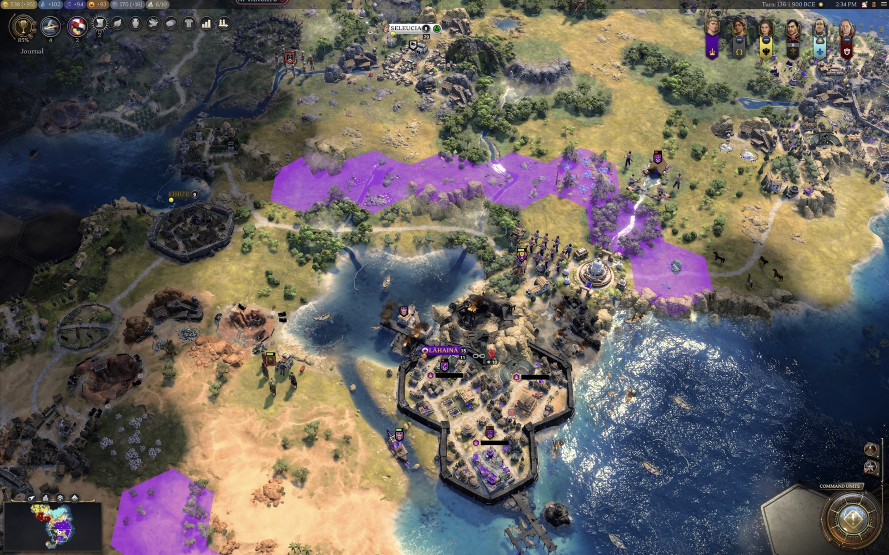

# Cultural Diffusion (Civ VII)

A reimagining and extension of the Cultural Diffusion mod for Civilization V, rebuilt
for Civ VII. Culture is a per-tile field that spreads outward from your cities over the
course of the game. A strong, established culture slowly pushes its borders past the
normal city footprint into open land, and can take a rival's frontier tiles where its
culture clearly wins there. This is a systemic answer to AI forward-settling: growing
your cultural border is the deterrent.

*The Cultural Pressure lens: the shaded band is the tiles your culture is winning. More in [gallery/](gallery/).*

Culture gains land only for you. Nearby AI cities add their own culture to the field, which
defends their tiles and slows yours, but the AI never takes land by culture. The one
exception is the opt-in recede mode, where a rival can win back a tile the mod claimed for you.

It runs in single-player only and sits behind an enable flag. Turning it off stops all new
claims, but tiles it already claimed stay yours, because the game cannot hand a city's tile
back to no one. It works standalone, and reads extra data from the
[Emigration](../emigration/) mod when that is also installed.

---

## How it works - a culture field, not a border calculation

The core of the mod (adapted from the Civ V original) is a reaction-diffusion
simulation over a persisted, per-tile, per-civ culture stock. Every
tile on the frontier remembers how much culture each civilization has deposited on
it. Once per turn, over a bounded region around your cities, four things happen:

### 1. Inject - cities pump culture into their own tile
Each city adds culture to the tile it sits on, using a self-amplifying curve
(`strength x sqrt(current x injectRatio) + injectBase`): the more culture already
present, the faster it grows, climbing over many turns toward a cap
(`strength x cityCapFactor`). **Strength** is not raw culture-per-turn - it's a
*fused* measure of the city's cultural power (see below), so an established or
prosperous city pumps a much bigger stock.

### 2. Diffuse - culture bleeds outward to neighbors
A tile with enough culture (`cultureThreshold`) spreads a fraction of its stock
(`diffusionRate`, ~5.5%/turn) to each of its 6 neighbors. A neighbor can hold at most
`normalMax` (40%) of the source's value - up to `maxPercent` (75%) when the culture
follows roads or rivers. Rough terrain slows or blocks the spread: forest, hills,
tundra, desert, jungle, marsh, and mountains each impose a penalty and a "crossing
threshold" the source must exceed before culture leaks across at all. If the
[Emigration](../emigration/) mod is present, diffusion is accelerated toward tiles
where your diaspora lives, so borders follow people.

Culture also crosses water, slowly and only once it is strong. Coast is easier to cross than
open ocean, and crossings ease through the ages (`diffuseAcrossWater`, `byAge[...].waterEase`,
`waterEaseRamp`). Tiles in your Distant Lands cannot be claimed before the Exploration age
(`blockDistantLandsBeforeExploration`).

### 3. Decay - every tile slowly loses culture
Each tile sheds `decayRate` (5%) + a flat point per turn. Decay is the constant brake
that the diffusion has to keep pushing against - it's what gives the border a stable
equilibrium, keeps growth slow, and lets culture ebb when the source city weakens or is
lost. With the opt-in **borders recede** option, a rival whose culture overtakes yours on a
claimed tile can take it (see step 5).

### 4. Flip - ownership is read off the stock
A tile becomes yours once **your** culture there is the largest, passes an absolute
floor (`minimumOwner`, 300), and - if you're taking it from a rival - beats their
culture on that tile by a decisive ratio (`flipRatio`, 0.65). It must also be within
`flipMaxDistance` (6) of one of your cities and, while `requireAdjacency` is on (default),
**adjacent to land you already own**, so borders grow contiguously. Freshly claimed tiles
are locked briefly (`flipCooldownTurns`) to prevent flicker. By default a rival's
**city-center plot is never taken** (culture may press inward through the surrounding tiles
ring by ring); the full downtown ring can still be shielded via the *rival city protection*
option (`coreProtectRadius`).

The game applies an ownership change a moment after the mod asks for it. Each flip is therefore
recorded as pending and confirmed from the map at the start of the next pass, before it counts
as a claim.

With the opt-in **+1 ring buffer** (`growthBuffer`, off by default), finishing a rural
improvement near your border also claims the unowned tiles right next to it, one ring past
your city's normal reach.

### 5. Recede (opt-in) - claimed tiles can be lost again
Off by default (`recedeBorders`). When on, each pass re-checks only the tiles this mod
claimed. If a rival's culture now beats yours there by the same decisive margin a claim
needs, the tile passes to that rival's nearest city. Tiles your cities grew are never touched.
A claim whose own culture fades simply stays yours: the engine will not release a tile that
is attached to a city, so there is no way to hand one back to no one. It stays off until the
hand-over has been watched working against a rival you are at peace with.

### Why growth is slow and organic
Because culture must physically build up **ring by ring against decay**, reach is an
**emergent traveling wave**, not a distance formula. In practice:

| Distance from city | Who owns it |
| --- | --- |
| Ring 1-3 | Always the base game - the mod never claims or reassigns your inner rings |
| Ring 4 | The first ring the mod claims, once a city's culture stock is large enough |
| Ring 5+ | Only a mature, entrenched culture |

In test games on a mature save, the strongest city made its first ring-4 claim 18 turns after
the mod started from an empty field. The mod held 29 claims after 45 turns, across an age
change, and a town with little culture never came close.

Early in a new game, expect nothing for a long while. In a 70-turn test game at the default
settings, a capital making 8 Culture claimed no tiles at all. At that strength, the pacing model
puts ring 4 out of reach. The mod starts claiming once a city's cultural power grows, so it
matters most from the mid-game onward.

An **overwhelming** culture injects a far bigger stock, so it pushes the *same* front
out **faster and farther** - organically, without any artificial "you're the leader"
switch. A weak or stagnant culture barely creeps past its border.

### What claimed land is - and is not
Civilization VII lets a city work and develop tiles only within three rings of its centre,
and that limit lives in the engine, not in any data a mod can change (see
[`docs/civ7-tile-range-investigation.md`](docs/civ7-tile-range-investigation.md)). Every tile
this mod claims lies beyond ring 3, so it is **territory, not yield**: it is attached to your
nearest city and shows as yours, but no citizen can work it and nothing can be built on it.
Its value is strategic - a buffer against rivals settling next to you, and frontier tiles
taken from a rival. The buffer is real: in a test game a settler could found on an empty
plot but not on the plot beside it once another civilization owned it.

---

## Cultural power - what makes a city "strong" (the fused model)

A city's **injection strength** is a **geometric blend** of its culture output with a
prosperity/vitality aggregate (`culture^alpha x vitality^(1-alpha)`), so that *cultural power*,
not just raw culture, drives how far your borders reach - and a single big +culture or
+happiness ability is one diluted term rather than a linear multiplier (this is what
keeps culture-focused leaders/civs leading without running away):

- **Culture + a prosperity aggregate (food, production, happiness, growth)** - a happy,
  prosperous, growing city pumps much harder than a struggling one, but a lone culture
  spike is flattened by the blend.
- **Celebration** - a golden age gives a pulse of extra cultural projection.
- **Cultural Power Index (CPI)** - a per-civilization multiplier built from your
  standing across six dimensions (wonders + great works, culture/turn, influence +
  city-state suzerainties, happiness + golden ages, empire prosperity, traditions +
  age), each measured as your share versus the strongest civ and combined so that
  *breadth* of cultural power beats a single-stat spike. A cultural hegemon's cities
  inject harder and therefore reach farther.
- **Ethnic affinity** *(requires Emigration)* - diffusion is pulled toward frontier
  tiles settled by your people.

**All of this is standalone-safe.** CPI and prosperity are computed from base-game
data alone; the ethnic-affinity layer is simply neutral when Emigration isn't
installed. Turn the whole fused model off (`Options -> Mods`) for a pure culture-only
source.

---

## Configuration

### Intensity presets (`Options -> Mods -> Cultural Diffusion - intensity`)
Change the feel with one knob. Higher intensity diffuses **faster**, decays
**slower**, and needs **less** culture to own a tile - so borders reach farther,
sooner.

| Preset | Diffusion | Decay | Ownership bar | Max distance |
| --- | --- | --- | --- | --- |
| **Low** (gentle nudge, empty land only) | 4.0% | 7% | 400 | 5 |
| **Medium** (default) | 5.5% | 5% | 300 | 6 |
| **High** (assertive) | 7.5% | 4% | 220 | 8 |

### Options toggles
- **Enabled** - master switch (off = vanilla borders).
- **Claim empty land only** - safety mode; never flip a tile owned by another civ.
- **Rival city protection** - how deep culture may push into a rival's city (full downtown
  ring, centre tile only, or nothing).
- **Contiguous border only** - only claim tiles touching your land.
- **Claim land beside new improvements (+1 ring)** - off by default; when on, finishing a rural
  improvement near your border also claims the unowned tiles right next to it.
- **Borders recede (experimental)** - off by default; claimed tiles can be ceded to a rival
  whose culture overtakes yours (step 5 above).
- **Rich cultural model** - fold CPI + prosperity into a city's cultural power. Off =
  raw culture only.
- **Follow diaspora (Emigration mod)** - read Emigration for ethnic-affinity
  diffusion. No effect if Emigration is absent.
- **Pressure lens** - on by default; a read-only map lens (Shift+C) shading the frontier
  tiles the mod is working toward changing hands, with a hover readout of each civilization's
  stock. Watched painting contested tiles in a test game.
- **Debug logging** - per-pass diagnostics to `UI.log`: every injector's strength and
  city-tile stock (`inject`), each city's best ring-4 stock against the ownership bar
  (`frontier`), and the persisted state size and pass time (`state bytes=`).

### Full tunables (`ui/cd-config.js`, all overridable)
- **Claiming:** `diffusionEnabled`, `claimOnlyUnowned`, `flipVerb` (`purchasePlot`, code-only),
  `refundGold`, `repairOrphans`, `growthBuffer`, `baseGrowthRadius`, `recedeBorders`.
- **Pacing / safety:** `turnInterval`, `fieldRadius`, `maxDiffusionPlots`,
  `maxFlipsPerTurn`, `flipCooldownTurns`, `coreProtectRadius`, `requireAdjacency`.
- **Field:** `cultureThreshold`, `diffusionRate`, `decayRate`, `decayFlat`,
  `normalMax`, `maxPercent`, `injectBase`, `injectRatio`, `cityCapFactor`,
  `minimumOwner`, `flipRatio`, `flipMaxDistance`.
- **Terrain and water:** `roadBonus`, `riverFollowBonus`, and a `{ malus, max, threshold }`
  entry per terrain (`terrainHills`, `terrainMountain`, `terrainTundra`, `terrainDesert`,
  `terrainForest`, `terrainJungle`, `terrainMarsh`, `terrainCoast`, `terrainOcean`), plus
  `diffuseAcrossWater`, `blockDistantLandsBeforeExploration` and `waterEaseRamp`.
- **Injection shaping (fused):** `fusedModel`, `useEmigration`, `cultureWeight`,
  `cultureExponent` (the geometric-blend alpha that dilutes lone culture spikes),
  `happinessAmp`, `wonderBonus`, `ageFactor`, `prosperityAmp`,
  `cpiPowerMin`/`cpiPowerMax`, the six CPI dimension weights
  (`wLegacy` ... `wIdentity`), `ethnicWeight`.
- **Game-settings calibration:** `calibrateToGameSettings`, `paceReferenceTurns`,
  `paceBounds`, `mapSizeScale` - re-times the field to the current age's length
  (`Game.maxTurns`) so the border arc is consistent across game speeds, and nudges
  injection by map size so cramped maps aren't steamrolled.
- **Per-age balance:** `byAge` - `{ injectionScale, ownerBar, waterEase }` for
  `ANTIQUITY`/`EXPLORATION`/`MODERN`. Later ages have ~8x the cities and ~3x the
  culture, so injection is damped and the ownership bar raised so a single city's reach
  stays comparable across ages.
- **Leader/civ/memento tuning:** `civTuningEnabled`, `civTuningStrength` (1 = full table,
  0 = every civ neutral). A bounded registry (`cd-civ-tuning.js`) damps culture/wonder/
  celebration/suzerainty snowball kits and territory-redundant civs (e.g. Xerxes'
  culture-on-capture), and gently lifts culture-poor ones. See
  [`mods_research_and_analysis/cultural-diffusion-leader-civ-memento-and-age-tuning.md`](../../mods_research_and_analysis/cultural-diffusion-leader-civ-memento-and-age-tuning.md).
- **Diagnostics:** `debug`, which turns on the per-pass log lines listed under Options.

---

## Architecture

The runtime is a set of small, single-responsibility UI-script modules (`ui/`):

| Module | Responsibility |
| --- | --- |
| `cd-bootstrap.js` | Boots the engine, runs one pass per local-player turn, console surface, the +1 ring buffer trigger. |
| `cd-pass.js` | The per-turn simulation: confirm pending -> inject -> diffuse -> decay -> flip -> recede. |
| `cd-pending.js` | Records ownership changes that have not landed yet and confirms them from the map next pass. |
| `cd-recede.js` | Opt-in recede step: cede a claimed tile to a rival whose culture decisively won it. |
| `cd-diagnostics.js` | Debug-only injector, frontier-ring, and state-size log lines. |
| `cd-field.js` | **Pure** field math (injection, decay, diffusion, ownership resolution). |
| `cd-terrain.js` | Per-step terrain diffusion modifiers (roads, rivers, rough ground). |
| `cd-pressure.js` | **Pure** injection-strength math (`projectionOf` + factors). |
| `cd-cpi.js` | **Pure** Cultural Power Index (share-vs-strongest -> geometric mean -> power). |
| `cd-metrics.js` | Base-game per-civ CPI dimension reads. |
| `cd-polity.js` | Per-settlement culture / happiness / wonders / prosperity reads. |
| `cd-emigration.js` | Optional, import-free bridge to the Emigration mod's data. |
| `cd-ethnicity.js` | Ethnic-affinity diffusion accelerant from composition data. |
| `cd-civ-tuning.js` | Bounded per-leader/civ/memento injection nudges (redundancy-only balance layer). |
| `cd-civ-roster.js` | The full game leader/civ/memento type rosters (data-only). |
| `cd-calibration.js` | Age-length (field pace) + map-size (injection) calibration from game settings. |
| `cd-plots.js` | GameplayMap reads (owners, radii, water, dimensions). |
| `cd-borders.js` | City-core protection + war checks. |
| `cd-ownership.js` | The one place that mutates ownership (refunded `purchasePlot`; `setOwnership` only to un-claim). |
| `cd-state.js` | Persisted culture field, claims, locks and pending changes (v2 schema), save/reload, pruning. |
| `cd-config.js` | Default tunables + intensity presets. |
| `cd-settings.js` / `cd-options.js` | Options-screen bridge + registration, through `Options.addInitCallback` so settings survive the Settings screen's rebuild. |
| `cd-pressure-lens.js` / `cd-pressure-tooltip.js` | The Cultural Pressure map lens (Shift+C) and its hover readout. |
| `cd-lens-colors.js` | Readable civilization colours for the lens. |
| `cd-notifications.js` | Throttled flip notifications. |
| `cd-log.js` | Logging. |

The pure modules (`cd-field`, `cd-pressure`, `cd-cpi`) carry the algorithm and are
unit-tested in Node with no engine, and `tests/pass.mjs` drives the whole pass against a stub
engine, including ownership that lands a pass late. `npm run verify` runs lint, syntax,
ESM-integrity, and the test suites. Engine behaviour is checked in real games with the
hands-free harness in [`devtools/harness/`](devtools/harness/).

---

## Standalone vs. Emigration

The mod has **no hard dependency** on Emigration. When Emigration is installed and the
"Follow diaspora" toggle is on, Cultural Diffusion reads its persisted population
composition (import-free, via the shared game-config store) to bias diffusion toward
your diaspora. When it's absent, that layer is simply neutral and everything else works
unchanged.

---

## Credits

This mod is a reimagining and extension of Gedemon's work, not a straight port.

- **Gedemon** - the *Cultural Diffusion* mod for Civilization V (v18), whose
  reaction-diffusion culture model is the core layer this mod builds on: the
  inject / diffuse / decay / flip loop over a per-tile culture stock, plus its
  terrain and ownership rules, follow that design.
- Everything layered on top of that core is new to this Civ VII version:
  - a per-civilization **Cultural Power Index** built from wonders, great works,
    culture, influence, city-state suzerainties, happiness, golden ages, traditions,
    and age;
  - the **prosperity / vitality composite** injection base that flattens lone culture
    and happiness spikes so culture leaders lead without running away;
  - **ethnic-affinity** diffusion that reads the Emigration mod's diaspora data so
    borders follow people (and stays standalone-safe when Emigration is absent);
  - the **per-leader / civilization / memento** balance-tuning layer and the
    **per-age** damping for Civ VII's three-age structure;
  - the **game-settings calibration** (age length, map size) reworked for Civ VII;
  - the Civ VII engine adaptation: terrain/biome/feature reads, `purchasePlot`
    integration, bounded-region simulation, persistence, the Options screen, and
    notifications.
- Per-turn pass structure, plot reads, persistence envelope, options screen, and
  notification throttling patterns are shared with the sibling Emigration mod.

## Notes & limitations

- Terrain (roads, river valleys, hills/mountains, tundra/desert biomes, forest/
  rainforest/marsh features) is read with the **Civ VII 1.4.1 map API**, and the pass has
  since run cleanly on 1.4.2
  (`GameplayMap.getTerrainType`/`getBiomeType`/`getFeatureType`/`isMountain`/
  `getRiverType`/`getRouteType`, via the `GameInfo.Terrains`/`Biomes`/`Features`
  lookups). Civ VII splits terrain (flat/hill/mountain) from biome (tundra/desert/...)
  and has no "snow" - modifiers stack per destination tile. Reads are still defensive:
  anything unreadable simply omits that modifier.
- Civ V swept the whole map each turn; Gameface can't, so the field is simulated in a
  bounded `fieldRadius` region around your cities.
- Claimed tiles are beyond ring 3 and so cannot be worked or developed - a native engine
  limit, not a mod setting. See "What claimed land is - and is not" above.
- The flip verbs were last watched on game 1.4.2 with the in-game harness
  (`devtools/harness/`). Ownership changes land a moment after the call, so a claim shows up
  in the mod's state one turn after the tile changes colour. Debug logging's
  `pending ... NOT APPLIED` lines are the tell if a patch breaks the verbs.
- The mod must be enabled when a game **starts**. A save keeps the mod list it was started
  with, so enabling the mod later has no effect on that save; tested in-game with the release
  build. When developing, redeploy by overwriting the folder in place rather than deleting it.
- See [`docs/current-model.md`](docs/current-model.md) §2 for the full model write-up
  and [`docs/probe-history.md`](docs/probe-history.md) / [`probe/`](probe/) for the feasibility probe.
